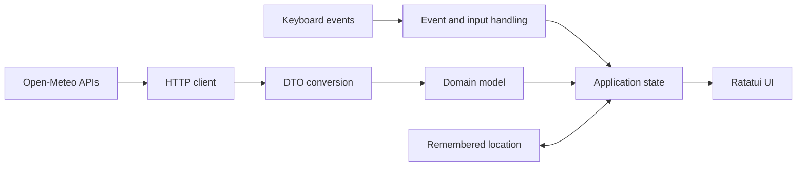

# Virga

[](https://github.com/t-shahan/virga/actions/workflows/ci.yml)
[](#license)

Virga is a responsive Rust terminal weather application for current conditions,
multi-day forecasts, historical context, and hourly precipitation
visualization. It is powered by Open-Meteo and requires no account or API key.

> **Project status: actively developed.** Virga works and is worth installing
> today. Features and fixes still land, so expect the occasional release.
> Contributions are welcome.

*Virga* is precipitation that evaporates before it reaches the ground. It is
also, most weeks, what the precipitation chart draws.


## Hourly precipitation

Press `p` for the hourly precipitation view. Probability rises above the
centre rule while forecast amount hangs below it — a tall spike with nothing
beneath it means “might drizzle”; tall above *and* below means take the
umbrella.


## Highlights

- **Current conditions** — temperature, feels-like, wind with gusts and
  direction, precipitation, daylight length, and US air quality index.
- **Eight-day forecast** — rain chance, maximum wind, UV index, sunrise, and
  sunset.
- **Three weeks of context** — fourteen days of historical highs followed by
  the current forecast, so today does not sit alone.
- **Hourly precipitation** — mirrored chance and amount, a next-rain countdown,
  a 24-hour running total, and separate snowfall reporting.
- **Fast navigation** — browse days or hours with the arrow keys, jump back to
  now, and inspect the selected period in detail.
- **Starts where you are** — the opening forecast is for the city your IP
  address resolves to, and a city you pick yourself replaces it permanently.
- **City search and live units** — search Open-Meteo's geocoder and switch
  between metric and imperial measurements without restarting.
- **Terminal-native presentation** — five foreground-only themes and responsive
  behavior down to a 34×12 terminal.

## Install

Virga needs a terminal with Unicode support and an internet connection. It does
not need Rust unless you are building it yourself.

### Homebrew

```bash
brew install t-shahan/tap/virga
```

macOS and Linux. This is the path that needs the least explanation on macOS,
because Homebrew does not apply the Gatekeeper quarantine that stops a binary
downloaded through a browser from opening.

### Install script

```bash
curl -fsSL https://raw.githubusercontent.com/t-shahan/virga/main/install.sh | sh
```

macOS and Linux. It picks the right build for your machine, checks the download
against the release's `SHA256SUMS` before installing anything, and puts the
binary in `~/.local/bin`. Two variables change what it does:

| Variable | Effect |
|---|---|
| `VIRGA_INSTALL_DIR` | Where the binary goes. Default `~/.local/bin` |
| `VIRGA_VERSION` | Install a specific tag, for example `v0.2.0` |

### Download it yourself

Every release on the [releases page][releases] carries a build for Linux
(x86_64 and aarch64, statically linked so distribution does not matter), macOS
(Apple silicon and Intel), and Windows (x86_64). Windows is not covered by the
install script, so the `.zip` is the way in.

Check what you downloaded against `SHA256SUMS`:

```bash
sha256sum --check --ignore-missing SHA256SUMS
```

Every binary also carries a build provenance attestation, which proves it was
produced by this repository's release workflow rather than by someone else:

```bash
gh attestation verify ./virga --repo t-shahan/virga
```

If you downloaded through a browser on macOS, Gatekeeper will refuse to open an
unsigned binary. Clear the quarantine flag:

```bash
xattr -dr com.apple.quarantine ./virga
```

### From source

Building requires **Rust 1.88 or later**. Ratatui requires 1.88 even though the
Rust 2024 edition itself supports earlier compilers.

```bash
cargo install --git https://github.com/t-shahan/virga
```

The binary lands at `~/.cargo/bin/virga`. From a local checkout, use `cargo run
--release`; a plain `cargo run` produces an unoptimized build that is noticeably
slower to render.

### Updating and removing

| Installed with | Update | Remove |
|---|---|---|
| Homebrew | `brew upgrade virga` | `brew uninstall virga` |
| Install script | Re-run the one-liner | `rm ~/.local/bin/virga` |
| Download | Download the new release | Delete the binary |
| Source | `cargo install --git https://github.com/t-shahan/virga --force` | `cargo uninstall virga-tui` |

Uninstalling from source takes the *package* name, `virga-tui`, not the binary
name.

Removing the binary leaves the one file Virga writes, a `state.json` holding the
last location you chose. It lives in the platform's per-user state directory:

| Platform | Path |
|---|---|
| macOS | `~/Library/Application Support/com.t-shahan.virga/state.json` |
| Linux | `~/.local/state/virga/state.json` |
| Windows | `%LOCALAPPDATA%\t-shahan\virga\data\state.json` |

[releases]: https://github.com/t-shahan/virga/releases/latest

## Keys

| Key | Action |
|---|---|
| `←` `→` | Previous / next day — or hour, on the precipitation screen; wraps |
| `↑` `↓` | Precipitation screen: back / forward a day, keeping the time of day |
| `n` / `Home` | Jump back to now |
| `p` | Hourly precipitation — `b`, `Enter` or `Esc` to go back |
| `l` | Search for a city (`Enter` selects, `↑` `↓` move, `Esc` cancels) |
| `r` | Refetch the current location |
| `u` | Toggle metric / imperial |
| `t` | Cycle the colour theme — the key bar names the one you land on for a few seconds |
| `q` / `Esc` / `Ctrl-C` | Quit |

The precipitation chart's centre rule marks the current hour (`┬`), the
selected one (`═`), and midnight (`┼`), so the three stay apart without relying
on colour. Its two halves show probability and precipitation amount on
different scales, so their heights are not comparable; the box title carries
the amount scale.

Choosing a city — or cancelling — returns to whichever screen the search was
opened from.

## Architecture

Virga separates provider-specific data and network activity from application
state and terminal rendering:



- [`src/ui/`](src/ui/) renders application state with Ratatui and performs no
  networking.
- [`src/weather/client.rs`](src/weather/client.rs) owns the weather,
  air-quality, and geocoding HTTP requests.
- [`src/weather/dto.rs`](src/weather/dto.rs) isolates Open-Meteo's wire formats
  and converts them into the stable domain data in
  [`src/weather/model.rs`](src/weather/model.rs).
- Event and input handling update application state, which coordinates
  navigation, search, refreshes, units, themes, and remembered location.

This boundary keeps provider changes out of the UI and makes both rendering and
API conversion independently testable.

## Engineering Quality

Virga's default locked test suite passes **269 deterministic tests**; two
provider-dependent live Open-Meteo tests are ignored during normal runs.
Coverage includes:

- deterministic rendering checks built with Ratatui's `TestBackend`, including
  narrow and awkward terminal sizes;
- navigation wraparound, selection invariants, and metric/imperial conversion
  boundaries;
- null, malformed, truncated, and mismatched API-response handling;
- loopback-server tests proving refused and silent connections fail or time out
  instead of blocking the interface; and
- state persistence, input filtering, themes, charts, and stale asynchronous
  response handling.

GitHub Actions runs the locked suite on Linux, macOS, and Windows. Separate
gates enforce rustfmt, Clippy with warnings denied, the Rust 1.88 minimum
supported version, package-content completeness, and pinned dependency audits.

## Themes

`t` steps through five palettes from either weather screen. The key bar names
the one you land on — `[t] theme (nord)` — and drops the name again a few
seconds later, so cycling tells you where you are without leaving a permanent
readout.

| Theme | Notes |
|---|---|
| `default` | The sixteen ANSI colours, so Virga looks the way your terminal is already configured to look |
| `gruvbox dark` | Warm throughout — orange bars, gold selection, green today |
| `nord` | Cool throughout — icy bars, aurora-purple selection |
| `tokyo night` | Blue and violet, with the selection the one warm thing on screen |
| `dracula` | The loud one — pink bars, lime selection, cyan today |

Every palette sets foregrounds only. None paints a background: your terminal's
own background remains visible, so a theme layers over your existing scheme
instead of stamping a separate dark rectangle over it.

The four non-default palettes use 24-bit colour. A terminal without truecolor
may approximate or ignore them, which is why `default` is the default: the
out-of-the-box appearance does not depend on truecolor support.

Set `VIRGA_THEME` to start somewhere other than the default. Names are
case-insensitive and forgiving about separators, so `tokyo night`,
`tokyo-night`, and `Tokyo_Night` select the same theme:

```bash
VIRGA_THEME=gruvbox-dark virga
```

An unrecognized name prints the known themes and starts in `default` rather
than refusing to run. The theme is not written to disk; like the unit toggle,
it lasts for the current session.

## Where it starts

Virga starts where your IP address says you are, so the first thing on screen is
your own weather rather than a city chosen for you.

Press `l` and pick somewhere, and that becomes the answer for good: a location
you chose is remembered in the platform's per-user state/data directory, and
every later launch starts there without asking the network anything. Detection
only runs while you have not chosen.

When the lookup does not answer — no network, or the service having a bad day —
Virga falls back to the last place it detected, and to New York City if it has
never detected one. The reason is printed on exit rather than shown as an error,
because a worse guess is not a reason to withhold the forecast.

Set `VIRGA_GEOIP=off` to skip the lookup entirely:

```bash
VIRGA_GEOIP=off virga
```

Startup is then the last location Virga knew, or New York City. An unrecognized
value prints a warning and leaves detection on rather than refusing to run.

## Configuration

`VIRGA_THEME` sets the startup palette and `VIRGA_GEOIP` turns location
detection off, both as described above. Unit and theme changes made in the app
last for the session.

Virga takes no options that change how it runs, since the terminal is the whole
interface. It answers two questions without starting up: `virga --version` and
`virga --help`.

## Contributing

Bug fixes, documentation improvements, tests, accessibility work, and
well-scoped features are welcome. Please open an issue before beginning a
substantial change so the approach and scope can be discussed. This is a
side project, so review timing varies, but pull requests do get read.

Before opening a pull request, run the same core checks used by CI:

```bash
cargo fmt --check
cargo clippy --all-targets --locked -- -D warnings
cargo test --locked --all-targets
cargo package --locked
```

Notable changes belong in [`CHANGELOG.md`](CHANGELOG.md) under `Unreleased`.
That is not bookkeeping for its own sake: release notes are generated from that
file, and both the release script and CI refuse to publish a version it does not
describe.

### Cutting a release

```bash
./scripts/release.sh 0.3.0
```

It checks the working tree, bumps the manifest, runs the four gates above, then
commits, tags, and pushes. From there
[`.github/workflows/release.yml`](.github/workflows/release.yml) builds all five
platforms, publishes the release with checksums and build provenance, and
updates the Homebrew tap. The tap push authenticates with a `TAP_KEY` secret
holding an SSH private key whose public half is a write-enabled deploy key on
[the tap repository](https://github.com/t-shahan/homebrew-tap). A deploy key
rather than a personal access token, because it grants write to that one
repository and nothing else, and does not expire. Without the secret the release
still publishes and only the tap update is skipped, with a warning.

## Limitations

- There is no general configuration file, and weather is never cached. Every
  launch fetches fresh weather; only the startup theme and location detection
  can be set through the environment.
- Detection is city-level and sometimes wrong. Behind a VPN or a carrier-grade
  NAT it lands near your provider rather than near you — `l` fixes that
  permanently, and `VIRGA_GEOIP=off` avoids the lookup altogether.
- Forecast text is English only.
- Terminals below 34×12 show a size warning instead of the interface.
- “Today” is distinguished by colour alone in the daily chart. The selection
  is not: every screen marks it by shape as well — a `>` in the forecast
  table's gutter, a `^` under the selected bar, and the precipitation chart's
  centre rule.
- Ghostty and Apple's Terminal app have been tested manually on macOS.
- Automated tests run on Linux, macOS, and Windows. They do not validate
  real-terminal rendering, font fallback, or held-key behavior.

## Data and Privacy

Weather, air quality, and geocoding all come from
[Open-Meteo](https://open-meteo.com), which needs no API key. Its free tier is
**for non-commercial use only** and is rate limited to 10,000 calls per day.
Each weather load makes two requests, and each submitted search makes a third.

Location detection is the one thing that does not go to Open-Meteo. On a launch
where you have not chosen a city, Virga makes a single request to
[ipapi.co](https://ipapi.co), which resolves the connection's own source address
to a city. Nothing else is sent — no query string, no identifier, no
coordinates, because working the coordinates out is the point of the request.
Their free tier needs no API key and allows 1,000 requests a day; Virga makes at
most one per launch. See ipapi.co's [privacy
policy](https://ipapi.co/privacy/) for what they retain.

That request is not made at all once you have chosen a city, or with
`VIRGA_GEOIP=off` set.

Virga stores only the last successfully loaded location label and coordinates
locally, in its per-user state/data directory, alongside a note of whether you
chose it or it was detected. Your IP address is never written to disk — the
resolved city is. It does not store weather responses, searches, or history.
Weather and air-quality requests send the location coordinates to Open-Meteo;
city searches submit their search text to its geocoder. Open-Meteo's
free-service logs may retain IP addresses and coordinates for 90 days. See
Open-Meteo's [terms](https://open-meteo.com/en/terms) and
[licence](https://open-meteo.com/en/license).

### Attribution

Weather data by [Open-Meteo](https://open-meteo.com), licensed
[CC BY 4.0](https://creativecommons.org/licenses/by/4.0/). Air-quality data is
served by Open-Meteo from the Copernicus Atmosphere Monitoring Service (CAMS),
whose [Air Quality API](https://open-meteo.com/en/docs/air-quality-api)
requires that both be credited.

<details>
<summary>Full CAMS citation</summary>

> METEO FRANCE, Institut national de l'environnement industriel et des risques
> (Ineris), Aarhus University, Norwegian Meteorological Institute (MET Norway),
> Jülich Institut für Energie- und Klimaforschung (IEK), Institute of
> Environmental Protection – National Research Institute (IEP-NRI), Koninklijk
> Nederlands Meteorologisch Instituut (KNMI), Nederlandse Organisatie voor
> toegepast-natuurwetenschappelijk onderzoek (TNO), Swedish Meteorological and
> Hydrological Institute (SMHI), Finnish Meteorological Institute (FMI),
> Italian National Agency for New Technologies, Energy and Sustainable Economic
> Development (ENEA) and Barcelona Supercomputing Center (BSC) (2022): CAMS
> European air quality forecasts, ENSEMBLE data. Copernicus Atmosphere
> Monitoring Service (CAMS) Atmosphere Data Store (ADS). (Updated twice daily).
>
> All users of Open-Meteo data must provide a clear attribution to CAMS
> ENSEMBLE data provider as well as a reference to Open-Meteo.

</details>

## License

Licensed under either of

- Apache License, Version 2.0 ([LICENSE-APACHE](LICENSE-APACHE) or
  <http://www.apache.org/licenses/LICENSE-2.0>)
- MIT license ([LICENSE-MIT](LICENSE-MIT) or
  <http://opensource.org/licenses/MIT>)

at your option. This covers the program's own source, which is separate from
the licensing of the data it fetches — see [Data and Privacy](#data-and-privacy).

Unless you explicitly state otherwise, any contribution intentionally submitted
for inclusion in this crate by you, as defined in the Apache-2.0 license, shall
be dual licensed as above, without any additional terms or conditions.
